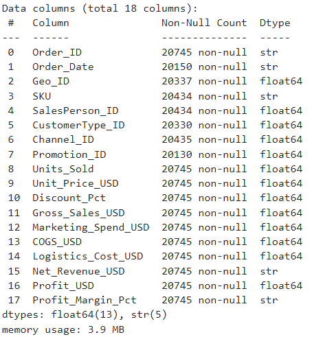
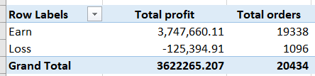
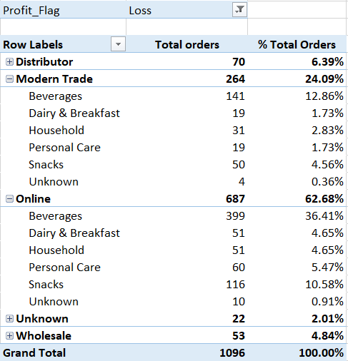
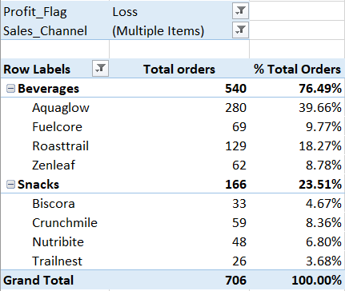
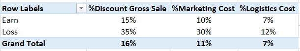
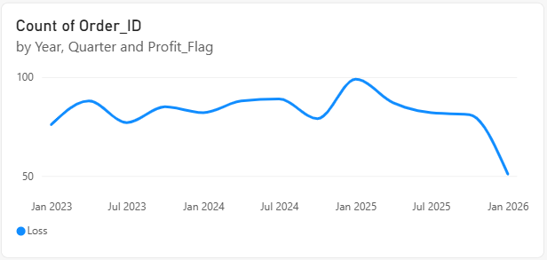
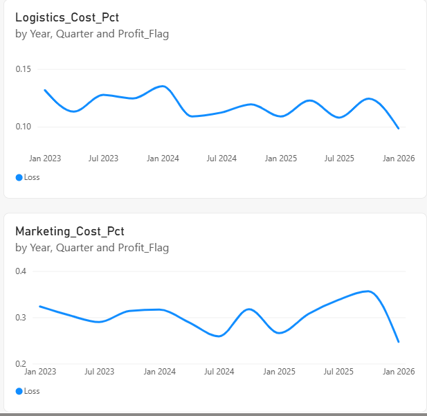
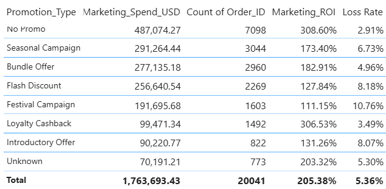

# FMCG Sales Analytics - Vì sao lỗ & Tối ưu đầu tư Marketing

## Giới thiệu

Dataset lấy từ **Kaggle** (FMCG sales & marketing profitability, 2023–2025, có bổ sung Q1/2026 tổng hợp để luyện tập), gồm đầy đủ cấu trúc P&L: Gross Sales, Discount, COGS, Marketing Spend, Logistics Cost, Net Revenue, Profit - trải theo Region/Country, Sales Channel, Product/SKU, Promotion Type và Sales Person.

**Flow xử lý:**
1. **Python** - làm sạch & merge các bảng dimension với FactSales, ghi kết quả thành bảng `Fact_Sales_Merged` trong **database SQLite**.
2. **Excel** - kết nối thẳng vào database qua ODBC/Power Query, dựng Pivot Table phân tích cấu trúc chi phí và nguyên nhân lỗ.
3. **Power BI** - cũng kết nối trực tiếp vào cùng database, phân tích xu hướng theo thời gian, hiệu quả khuyến mãi và xác định ngưỡng an toàn.

Project trả lời 2 câu hỏi:
1. **Vì sao đơn hàng bị lỗ**, và **ngưỡng an toàn** cho Discount / Marketing Cost / Logistics Cost là bao nhiêu?
2. **Chương trình khuyến mãi nào hiệu quả**, nên phân bổ ngân sách nhiều hơn?

---

## 1. Cleaning - Python (`Data_Cleanning.ipynb`)

Dữ liệu gốc 20,745 dòng, nhiều lỗi được phát hiện và xử lý:

**Lỗi Null:**
- `Geo_ID`, `SalesPerson_ID`, `CustomerType_ID`, `Channel_ID`, `Promotion_ID` bị thiếu → gán `-1` (Unknown).
- `SKU` bị thiếu → gán `'Unknown'`.

**Lỗi định dạng (format):**
- `Net_Revenue_USD` lưu dạng chuỗi có ký tự `$` và dấu phẩy (`"$1,234.56"`) → làm sạch ký tự rồi convert về số.
- `Profit_Margin_Pct` lưu dạng chuỗi có ký tự `%` → làm sạch rồi convert về số.
- `Order_Date` lẫn 4 định dạng khác nhau (`yyyy-mm-dd hh:mm:ss`, `yyyy-mm-dd`, `dd/mm/yyyy`, `mm-dd-yyyy`) → viết hàm parse đa định dạng, gộp về `Order_Date_Cleaned`.
- Mã tham chiếu lạ không khớp dimension table (`Geo_ID=9999`, `Channel_ID=999`, `Promotion_ID=999`) → gán lại `-1`.
- Dimension table: khoảng trắng thừa, viết hoa không nhất quán, trùng lặp → chuẩn hóa (`strip`, `title case`, `drop_duplicates`).

**Giá trị ngoại lai / không hợp lệ:**
| Lỗi | Số dòng |
|---|---|
| `Units_Sold` âm (đơn hoàn trả) | 207 |
| `Unit_Price_USD = 0` | 104 |
| `Discount_Pct > 100%` (lỗi nhập liệu) | 166 |

→ Sau khi loại các dòng lỗi trên: **còn lại 20,434 đơn hàng hợp lệ**, dùng cho toàn bộ phân tích bên dưới.

---

## 2. Analyst - Excel Pivot Table (`loss-root-causes.xlsx`)

**Tình trạng đơn lời/lỗ**

94.6% đơn hàng (19,338 đơn) có lãi 3,747,660 USD; 5.4% (1,096 đơn) lỗ 125,395 USD.

**Đơn lỗ tập trung ở kênh nào**

Lỗ tập trung chủ yếu ở **Online (62.7%)** và **Modern Trade (24.1%)** - cộng lại chiếm 86.8% tổng số đơn Loss. Trong 2 kênh này, ngành hàng **Beverages** và **Snacks** chiếm tỷ trọng cao nhất.

**Lọc sâu hơn - Brand nào**

Trong nhóm Beverages, **Aquaglow** dẫn đầu số đơn lỗ (39.7%), tiếp theo **Roasttrail** (18.3%). Trong nhóm Snacks, **Crunchmile** cao nhất (8.4%). Đây là các brand cần rà soát ưu tiên.

**So sánh cấu trúc chi phí - Earn vs Loss**

| | Earn | Loss | Chênh lệch |
|---|---|---|---|
| %Discount | 15% | 35% | 2.3 lần |
| %Marketing Cost | 10% | 30% | 2.9 lần |
| %Logistics Cost | 7% | 12% | 1.7 lần |

Marketing Cost là yếu tố ảnh hưởng mạnh nhất đến việc một đơn hàng bị lỗ.

---

## 3. Power BI - Dashboard (`annual_cost_and_promotion_analysis.pbix`)

**Xu hướng theo thời gian**

Số đơn Loss có dấu hiệu cải thiện vào đầu năm 2026. *Lưu ý: 2026 chỉ có dữ liệu Q1 (tổng hợp thêm để luyện tập, không phải dữ liệu đầy đủ cả năm), nên xu hướng này cần xác nhận thêm khi có đủ dữ liệu.*

Cả %Logistics Cost và %Marketing Cost cũng có xu hướng giảm về cuối kỳ, cùng chiều với việc số đơn Loss giảm.

**Vì sao Logistics Cost góp phần gây lỗ**

Dataset hiện không có thông tin về hình thức vận chuyển hay đơn vị vận chuyển (carrier), nên chưa thể xác định chính xác nguyên nhân gốc (do tuyến đường, do đơn vị vận chuyển, hay do loại hàng) - đây là hạn chế dữ liệu cần bổ sung nếu muốn phân tích sâu hơn.

**Hiệu quả khuyến mãi (Promotion Type)**

**No Promo** có Marketing Spend cao nhất (487,074 USD), đồng thời ROI cao nhất (308.6%) và Loss Rate thấp nhất (2.91%). **Loyalty Cashback** tương tự - ROI cao (306.5%), Loss Rate thấp (3.49%). Ngược lại, **Festival Campaign** có ROI thấp nhất (111.2%) và Loss Rate cao nhất (10.76%) - nên cân nhắc giảm ngân sách cho chương trình này.

**Ngưỡng an toàn cho chi phí**

Xác định bằng cách chia bin và tính Loss Rate theo từng khoảng (DAX measure):

- **Marketing Cost:** an toàn khi ≤ 15–20% Gross Sale (Loss Rate dưới 5%); vượt 30% → Loss Rate tăng lên ~74%.
- **Logistics Cost (theo Units_Sold):** đơn từ 150 sản phẩm trở lên → Loss Rate giảm rõ rệt (từ ~9% xuống 3.2%, và xuống 1.8% khi trên 250 sản phẩm) - gợi ý ngưỡng miễn ship/gộp đơn.
- **Discount:** không phải driver mạnh trong khoảng 0–30% (Loss Rate ổn định 2–5%). Riêng nhóm ghi nhận Discount 100% chủ yếu là lỗi dữ liệu (đã nêu ở phần Cleaning), không phản ánh hành vi kinh doanh thật.

---

## Key Insights

1. **94.6% đơn hàng có lãi**, nhưng 5.4% đơn Loss (1,096 đơn) đã ăn mòn 125,395 USD lợi nhuận.
2. **Marketing Cost là cost driver mạnh nhất** gây lỗ (Loss cao gấp 2.9 lần Earn), tiếp theo Discount (2.3 lần), Logistics (1.7 lần) - không phải Unit Price hay COGS (2 yếu tố này không đổi/không kiểm soát được).
3. **Lỗ tập trung rõ vào 2 kênh**: Online + Modern Trade (86.8% tổng đơn Loss), ngành hàng Beverages, và 2 brand Aquaglow + Roasttrail - đây là nhóm cần rà soát ưu tiên thay vì xử lý dàn trải toàn bộ danh mục.
4. **Ngưỡng an toàn rõ ràng cho 2/3 chi phí**: Marketing Cost ≤15-20% Gross Sale, đơn hàng ≥150 units. Riêng Discount không cho thấy quan hệ nhân quả rõ trong khoảng hợp lệ (0-30%).
5. **No Promo và Loyalty Cashback là 2 hình thức hiệu quả nhất** (ROI cao, Loss Rate thấp) - nên ưu tiên phân bổ ngân sách, trong khi Festival Campaign (ROI thấp nhất, Loss Rate cao nhất) nên cắt giảm.
6. Xu hướng Loss/Logistics%/Marketing% đều cải thiện về Q1/2026 - tín hiệu tích cực nhưng cần thêm dữ liệu đầy đủ năm để xác nhận không phải nhiễu do dữ liệu tổng hợp.

## Hạn chế

- **Dữ liệu 2026 chưa đầy đủ** - chỉ có Q1, là dữ liệu tổng hợp (synthetic) thêm để luyện tập, không phải dữ liệu thật cả năm. Mọi kết luận về xu hướng cải thiện cuối kỳ cần xác nhận lại khi có đủ dữ liệu.
- **Không có thông tin vận chuyển** (hình thức, đơn vị vận chuyển/carrier) nên chưa xác định được nguyên nhân gốc của Logistics Cost cao - chỉ dừng ở mức quan sát tương quan với quy mô đơn hàng (Units_Sold).
- **Correlation, không phải causation** - Discount, Marketing Cost và Logistics Cost đều tương quan với Loss, nhưng project chưa kiểm định liệu 3 yếu tố này có tương quan lẫn nhau không (ví dụ đơn discount cao có luôn đi kèm marketing cao). Nếu có, một phần ảnh hưởng có thể bị đếm trùng giữa các yếu tố.
- **166 dòng Discount_Pct gốc >100%** đã được cap về 100% thay vì truy được giá trị đúng - đây là lỗi nhập liệu chưa rõ nguồn gốc, cần điều tra thêm nếu muốn dùng nhóm này cho phân tích sâu hơn.
